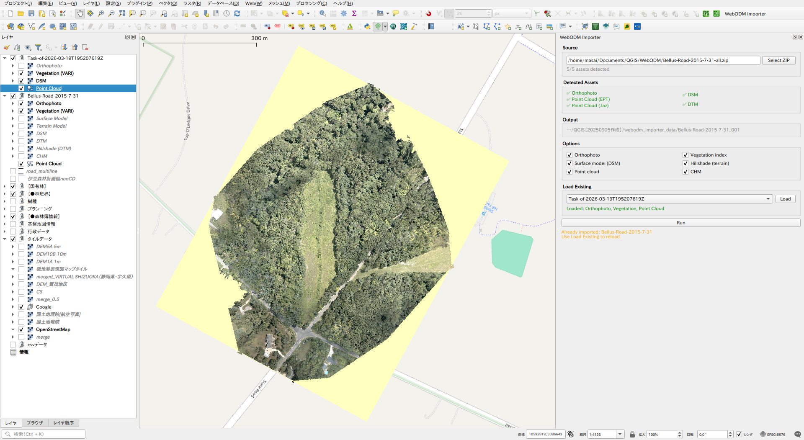
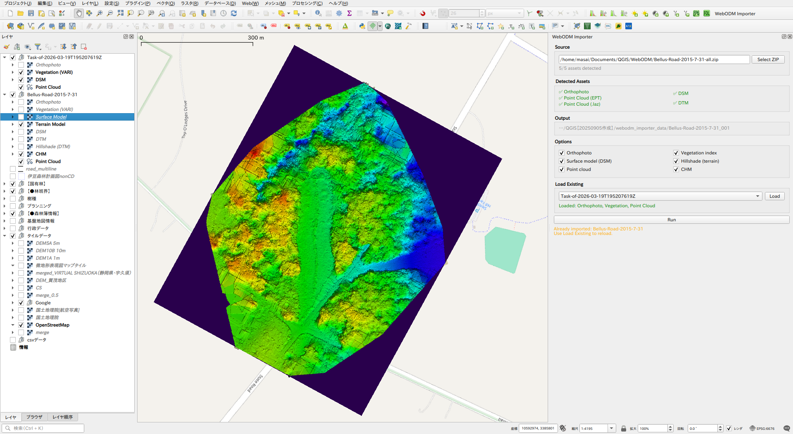

# WebODM Importer

A QGIS plugin that imports [WebODM](https://github.com/OpenDroneMap/WebODM) task output (ZIP) into QGIS, automatically detects assets, generates derived layers, and organises them into a named layer group.

| Orthophoto | Terrain Model |
|------------|---------------|
|  |  |

## Features

- **ZIP import**: Select a WebODM task ZIP — no manual extraction required
- **Asset detection**: Automatically detects orthophoto, DSM, DTM, and point cloud (EPT or .laz)
- **Derived layers**: Generates CHM (DSM − DTM), vegetation index (VARI), hillshade, and composite surface/terrain models
- **Composite models**: Surface Model (DSM + hillshade) and Terrain Model (DTM + hillshade) baked into single RGB GeoTIFFs
- **Duplicate detection**: MD5 hash check prevents re-importing the same ZIP twice
- **Layer organisation**: All layers are grouped under the dataset name at the top of the layer tree

## Output structure

```
{project}/webodm_importer_data/{dataset_name}/
├── odm_orthophoto/odm_orthophoto.tif   ← extracted from ZIP
├── odm_dem/dsm.tif
├── odm_dem/dtm.tif
├── odm_georeferencing/odm_georeferenced_model.laz  ← LAZ fallback
├── entwine_pointcloud/ept.json                     ← EPT (preferred)
├── entwine_pointcloud/ept-data/…
├── vegetation.tif                       ← generated
├── hillshade_dsm.tif
├── hillshade_dtm.tif
├── surface_model.tif                    ← DSM + hillshade (from DSM) composite
├── terrain_model.tif                    ← DTM + hillshade (from DTM) composite
├── chm.tif
└── .import_meta.json                    ← hash record
```

## Layer order (in QGIS)

| Layer | Description |
|-------|-------------|
| Orthophoto | RGB orthophoto |
| Vegetation (VARI) | Vegetation index (green = healthy) |
| Surface Model | DSM with hillshade baked in |
| Terrain Model | DTM with hillshade baked in |
| DSM | Raw surface elevation |
| DTM | Raw terrain elevation |
| Hillshade (DTM) | Greyscale hillshade from DTM |
| CHM | Canopy Height Model (DSM − DTM) |
| Point Cloud | EPT point cloud (preferred); falls back to .laz via PDAL |

## Usage

1. Open the panel via **Raster → WebODM Importer**
2. Click **Select ZIP** to select a WebODM task output ZIP
3. Check the detected assets and select which layers to generate
4. Set the output name (defaults to the ZIP filename)
5. Click **Run**

To reload a previously imported dataset, use the **Load Existing** dropdown.

## Notes

- If the same ZIP (by content hash) has already been imported, re-import is blocked
- Output folder name is auto-incremented (`_001`, `_002` …) if the name already exists
- EPT point clouds are loaded directly; .laz fallback requires the QGIS PDAL provider

## Colour rendering

Layer styles (elevation ramp, vegetation index, hillshade) are applied using generic QGIS colour schemes and do not replicate the WebODM web interface display. Styles can be customised after import via the QGIS layer properties.

## Requirements

- QGIS 3.16 or later
- PDAL provider (for .laz fallback only; bundled with QGIS 3.18+)
- WebODM task output ZIP

## License

This plugin is distributed under the GNU General Public License v2 or later.
See [LICENSE](LICENSE) for details.

## Support

If this plugin is helpful for your work, you can support the development here:
https://paypal.me/rawslnc

## Author

(C) 2026 by Hideharu Masai
