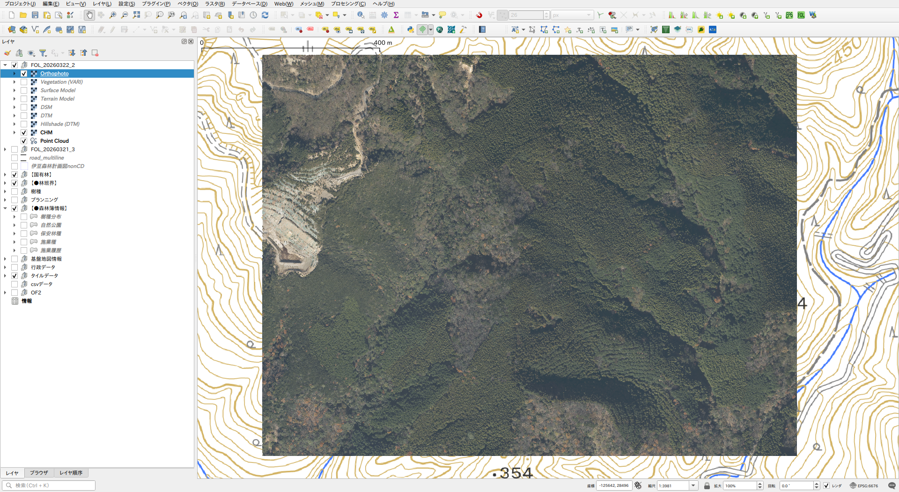
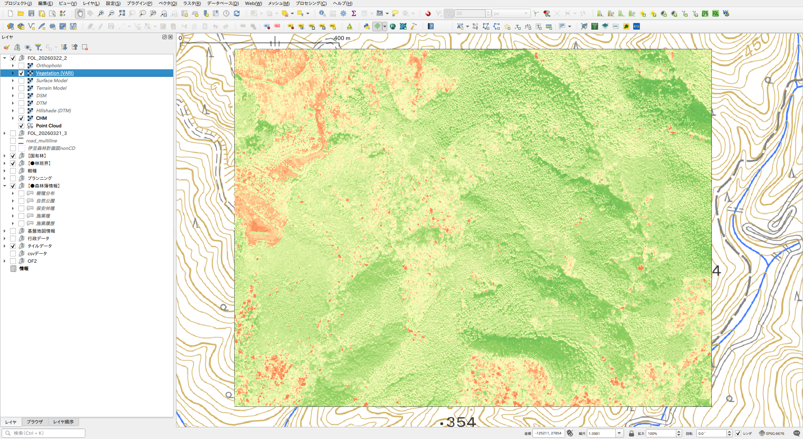
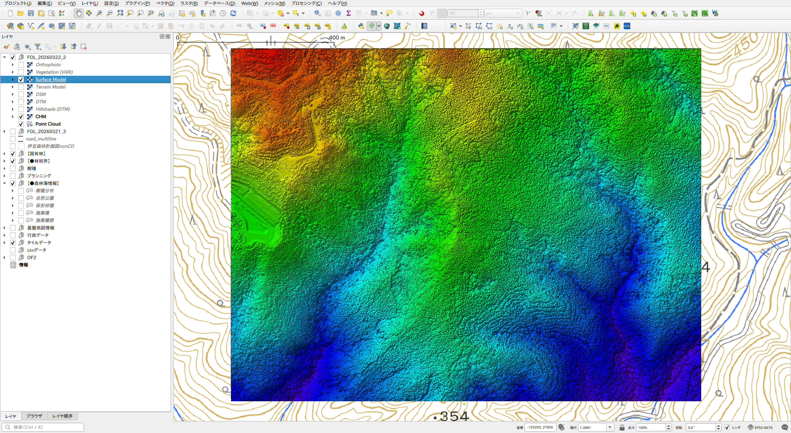
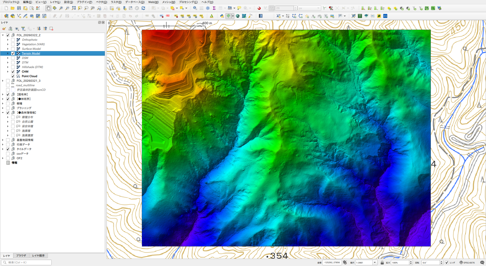
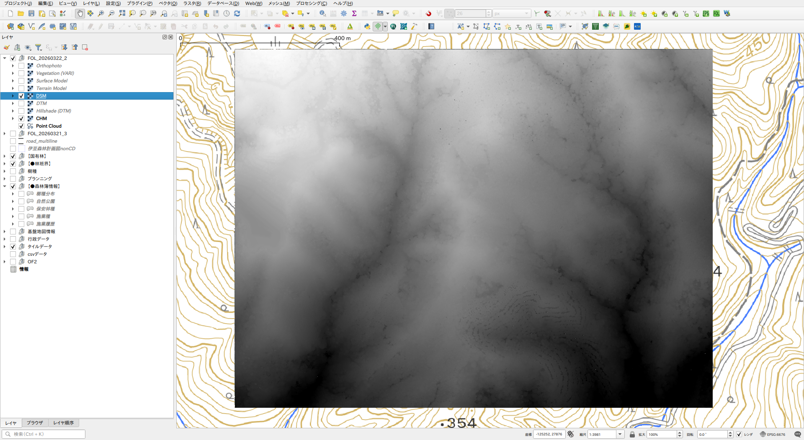
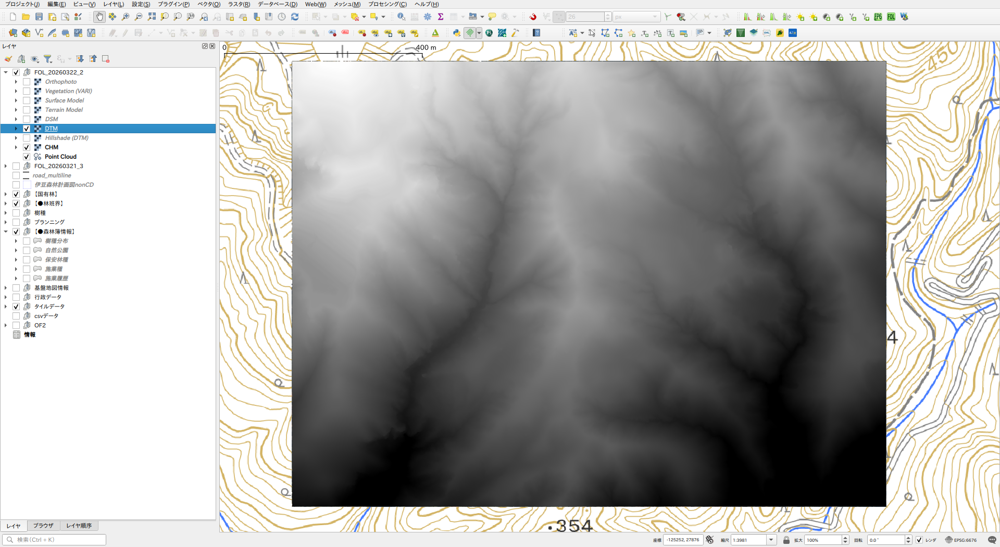
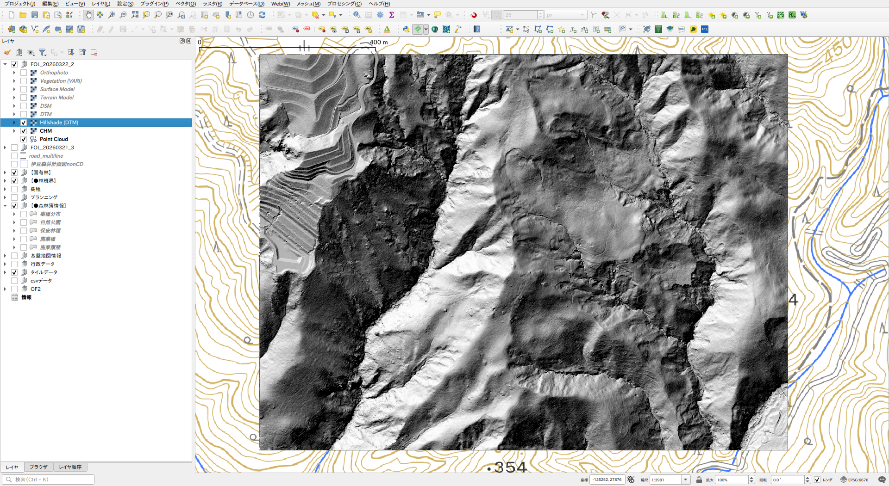
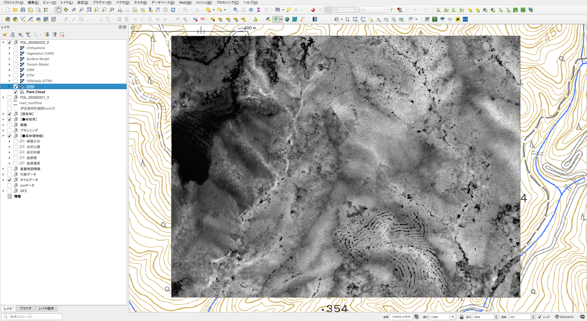
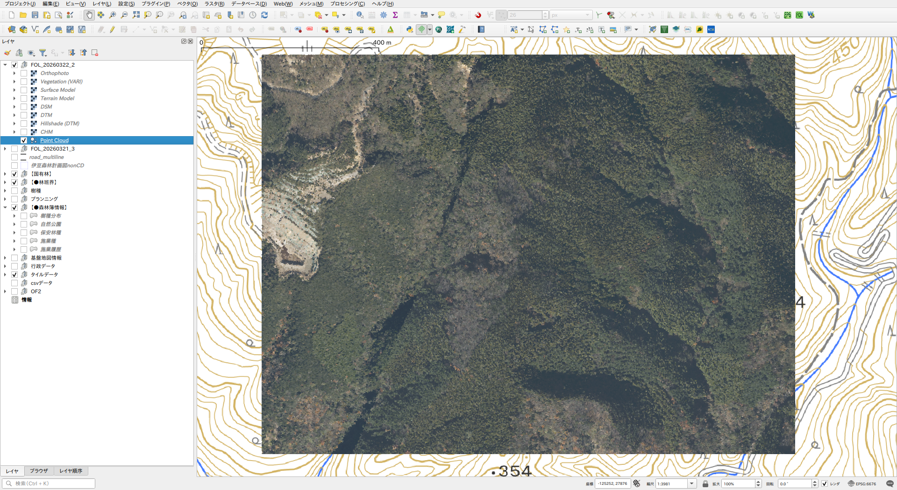

# WebODM Importer

A QGIS plugin that imports [WebODM](https://github.com/OpenDroneMap/WebODM) task output (ZIP) into QGIS, automatically detects assets, generates derived layers, and organises them into a named layer group.

| Orthophoto | Terrain Model |
|------------|---------------|
|  |  |

## Features

- **ZIP import**: Select a WebODM task ZIP — no manual extraction required
- **Asset detection**: Automatically detects orthophoto, DSM, DTM, and point cloud (EPT or .laz)
- **Derived layers**: Generates CHM (DSM − DTM), vegetation index (VARI), hillshade, and composite surface/terrain models
- **Composite models**: Surface Model (DSM + hillshade) and Terrain Model (DTM + hillshade) baked into single RGB GeoTIFFs
- **Duplicate detection**: MD5 hash check prevents re-importing the same ZIP twice
- **Layer organisation**: All layers are grouped under the dataset name at the top of the layer tree

## Output structure

```
{project}/webodm_importer_data/{dataset_name}/
├── odm_orthophoto/odm_orthophoto.tif   ← extracted from ZIP
├── odm_dem/dsm.tif
├── odm_dem/dtm.tif
├── odm_georeferencing/odm_georeferenced_model.laz  ← LAZ fallback
├── entwine_pointcloud/ept.json                     ← EPT (preferred)
├── entwine_pointcloud/ept-data/…
├── vegetation.tif                       ← generated
├── hillshade_dsm.tif
├── hillshade_dtm.tif
├── surface_model.tif                    ← DSM + hillshade (from DSM) composite
├── terrain_model.tif                    ← DTM + hillshade (from DTM) composite
├── chm.tif
└── .import_meta.json                    ← hash record
```

### Preparing your own data

If you have your own DEM/DSM files, you can use this plugin without WebODM by placing files in the exact paths shown above.

**Minimum required files:**

```
{project}/webodm_importer_data/{dataset_name}/
├── odm_dem/dsm.tif    ← DSM (surface model)
└── odm_dem/dtm.tif    ← DTM (terrain model)
```

**Optional:**

```
├── odm_orthophoto/odm_orthophoto.tif
└── odm_georeferencing/{name}.las  or  .laz   ← filename is flexible
```

Hillshade, composite models (Surface Model / Terrain Model), CHM, and vegetation index are all **generated by the plugin** from the files above — you do not need to prepare them.

Place the files in the structure above, then select the dataset folder via the **Load Existing** dropdown.

> **Note — FOL (Forestry Operations Lite) VS Export**
>
> ZIPs exported from the Forestry Operations Lite plugin (Virtual Shizuoka data) are also supported.
> In this format, LAS files are **not embedded** in the ZIP. Instead, the ZIP contains:
>
> - `las_sources.json` — relative paths from the ZIP to the LAS files on disk
> - `README_LAS_LINKS.txt` — S3 download URLs for the LAS files (for reference)
>
> The LAS files must be present at the relative paths listed in `las_sources.json`.
> If they have been moved or are unavailable, point cloud loading will be skipped.

## Layer order (in QGIS)

| Layer | Description |
|-------|-------------|
| Orthophoto | RGB orthophoto |
| Vegetation (VARI) | Vegetation index (green = healthy) |
| Surface Model | DSM with hillshade baked in |
| Terrain Model | DTM with hillshade baked in |
| DSM | Raw surface elevation |
| DTM | Raw terrain elevation |
| Hillshade (DTM) | Greyscale hillshade from DTM |
| CHM | Canopy Height Model (DSM − DTM) |
| Point Cloud | EPT point cloud (preferred); falls back to LAS/LAZ with automatic COPC conversion |

## Example output — Virtual Shizuoka

<table>
  <tr>
    <td align="center"><b>Orthophoto</b></td>
    <td align="center"><b>Vegetation (VARI)</b></td>
    <td align="center"><b>Surface Model</b></td>
  </tr>
  <tr>
    <td></td>
    <td></td>
    <td></td>
  </tr>
  <tr>
    <td align="center"><b>Terrain Model</b></td>
    <td align="center"><b>DSM</b></td>
    <td align="center"><b>DTM</b></td>
  </tr>
  <tr>
    <td></td>
    <td></td>
    <td></td>
  </tr>
  <tr>
    <td align="center"><b>Hillshade (DTM)</b></td>
    <td align="center"><b>CHM</b></td>
    <td align="center"><b>Point Cloud</b></td>
  </tr>
  <tr>
    <td></td>
    <td></td>
    <td></td>
  </tr>
</table>

## Usage

1. Open the panel via **Raster → WebODM Importer**
2. Click **Select ZIP** to select a WebODM task output ZIP
3. Check the detected assets and select which layers to generate
4. Set the output name (defaults to the ZIP filename)
5. Click **Run**

To reload a previously imported dataset, use the **Load Existing** dropdown.

## Notes

- If the same ZIP (by content hash) has already been imported, re-import is blocked
- Output folder name is auto-incremented (`_001`, `_002` …) if the name already exists
- EPT and COPC point clouds load via built-in QGIS providers (no additional setup required)
- LAS/LAZ files are converted to COPC automatically if `pdal` CLI is installed

## Colour rendering

Layer styles (elevation ramp, vegetation index, hillshade) are applied using generic QGIS colour schemes and do not replicate the WebODM web interface display. Styles can be customised after import via the QGIS layer properties.

## Requirements

- QGIS 3.18 or later
- WebODM task output ZIP

### Point Cloud

WebODM outputs EPT format (`entwine_pointcloud/ept.json`) by default when point cloud processing is enabled.
EPT is supported by all QGIS environments and requires no additional setup.

If the ZIP contains only LAS/LAZ files (no EPT), the plugin attempts to load them in the following order:

1. Load directly via a built-in QGIS point cloud provider
2. If that fails, convert to COPC format using the `pdal` CLI, then load

Installing the `pdal` CLI is recommended on Linux, where the QGIS PDAL provider may not be included in standard packages.
If `pdal` is not installed and direct loading fails, the point cloud layer is silently skipped.

## Support

If this plugin is helpful for your work, you can support the development here:
https://paypal.me/rawslnc

## License

This plugin is distributed under the GNU General Public License v2 or later.
See [LICENSE](LICENSE) for details.

## Author

Copyright (C) 2026 Hideharu Masai
